# Plastik Enjeksiyon Kalıplarında Warping (Çarpılma) Azaltmak İçin Eklemeli İmalat Uygulamaları ile Geleneksel Çözümlerin Kıyaslanması

**Yazar:** Osman YILDIRIM (Öğrenci No: 22110081305)  
**Kurum:** T.C. Kahramanmaraş Sütçü İmam Üniversitesi, Mühendislik ve Mimarlık Fakültesi, Makine Mühendisliği Bölümü  
**Tarih:** 2026  
**Yazılımlar:** Autodesk Moldflow Insight, SolidWorks 2022 CAD  
**Malzemeler:** Victrex PEEK 450CA30 Polimeri, P20 Kalıp Çeliği, Su Soğutucu Akışkan  

---

## Özet ve Temel Bulgular

Bu çalışmada, plastik enjeksiyon kalıplarında eklemeli imalat (3D Printing) teknolojisinin sunduğu serbest form tasarım kabiliyetleri kullanılarak geliştirilen **Helisel Conformal Cooling (Uyumlu Soğutma)** kanalları ile sanayide yaygın olarak kullanılan **Geleneksel (Baffle tipi)** soğutma kanalları sayısal simülasyonlarla kıyaslanmıştır.

- **Soğutma Kaynaklı Çarpılma (Differential Cooling):** 2.246 mm'den **1.182 mm**'ye düşürülerek **%47.4 iyileşme** sağlanmıştır.
- **Kritik Mesh Düğümü 71077 (Taban Çeperi):** Deformasyon miktarı **%53.0** oranında azaltılmıştır.
- **İç Duvar Sıcaklığı:** Geleneksel kanallarda 199.2°C iken Helisel tasarımda **91.65°C**'ye inerek **107.55°C** daha homojen bir soğuma elde edilmiştir.
- **Kalıp Maksimum Sıcaklığı:** 269.1°C'den **159.6°C**'ye düşürülmüştür.

---

## 1. Giriş

### 1.1 Eklemeli İmalat (Additive Manufacturing)
Eklemeli imalat, bir ürünün sanal 3 Boyutlu geometrik verilerinin yazıcı tarafından katman katman olacak şekilde eklenmesiyle yapılan bir imalat yöntemidir. İlk başta hızlı prototipleme amacıyla geliştirilmiş, günümüzde ise doğrudan nihai parça ve kalıp içi karmaşık çekirdeklerin seri üretiminde kullanılmaya başlanmıştır (Özsoy ve Duman, 2017). Formula 1 ve havacılık gibi yoğun optimizasyon gerektiren sektörlerin yanı sıra, kalıpçılık sektöründe geleneksel CNC delme operasyonlarıyla imkansız olan kavisli/helisel soğutma kanallarının imalatında devrim yaratmıştır.

### 1.2 Plastik Enjeksiyon ve Soğuma Süresi
Plastik enjeksiyon; ısıtılmış termoplastik veya termoset plastik malzemelerin, yüksek basınçla bir kalıp boşluğuna enjekte edilmesi ve kalıp içinde soğuyup katılaşarak parçanın şeklini alması esasına dayanır. Seri üretimde birim parça maliyetini ve döngü süresini (cycle time) belirleyen en kritik aşama **soğuma süresidir**. Soğumanın parçanın her yerinde homojen olmaması, artık gerilmelere (residual stress) ve nihai üründe kabul edilemez boyutsal çarpılmalara (**warping**) yol açar.

### 1.3 Çalışmanın Amacı ve Yöntem
Bu çalışmada, karmaşık geometrili bir plastik parçanın enjeksiyon kalıbı için:
1. Geleneksel yöntemle delinebilen doğrusal delikler ve Baffle tipi soğutma kanalları,
2. Eklemeli imalatla üretilebilen, parça profilini içten ve dıştan saran **Çift Helisel Conformal Cooling** kanalları

SolidWorks 2022'de 3D olarak modellenmiş; Autodesk Moldflow yazılımında **Flow (Akış), Cool (Soğutma) ve Warp (Çarpılma)** analizlerine tabi tutularak sayısal olarak karşılaştırılmıştır.

---

## 2. Malzeme ve Ekipmanlar

| Parametre / Ekipman | Seçilen Malzeme / Yazılım | Teknik Özellik / Gerekçe |
| :--- | :--- | :--- |
| **Plastik Malzeme** | Victrex PEEK 450CA30 | %30 Karbon fiber takviyeli, yüksek sıcaklık ve mekanik dayanımlı mühendislik polimeri. Yüksek eriyik sıcaklığı (380-400°C) nedeniyle soğutma optimizasyonu kritiktir. |
| **Kalıp Çeliği** | P20 Kalıp Çeliği (Steel P2) | Plastik enjeksiyon kalıplarında sanayi standardı, yüksek işlenebilirlik ve dengeli ısıl iletkenlik. |
| **Soğutucu Akışkan** | Su (H₂O) | Yüksek özgül ısı kapasitesi ($c_p$) ve ekonomik olması nedeniyle tercih edilmiştir. |
| **CAD Tasarım** | SolidWorks 2022 | Parça, sıcak yolluk, besleme kapıları ve kavisli helis soğutma kanallarının 3D parametrik modellemesi. |
| **Simülasyon Motoru** | Autodesk Moldflow Insight | Flow (dolum süresi, akış yönü, kaynak çizgileri), Cool (termal gradyan) ve Warp (differential cooling, orientation, shrink) analizleri. |

---

## 3. Tasarım ve Modelleme Süreci

### 3.1 2D Teknik Çizim ve 3D Geometri
Parçanın ince cidar kalınlıkları ve kavisli hatları, hem iç göbekten hem de dış çeperden çift taraflı soğutma gerektirmektedir.

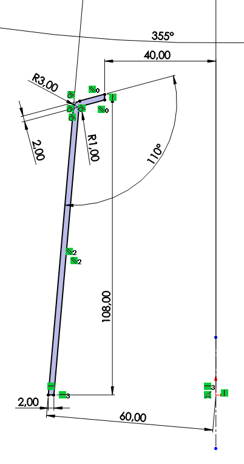  
*Şekil 1: Plastik parçanın SolidWorks 2022 ortamında hazırlanan 2D teknik çizimi ve imalat ölçüleri.*

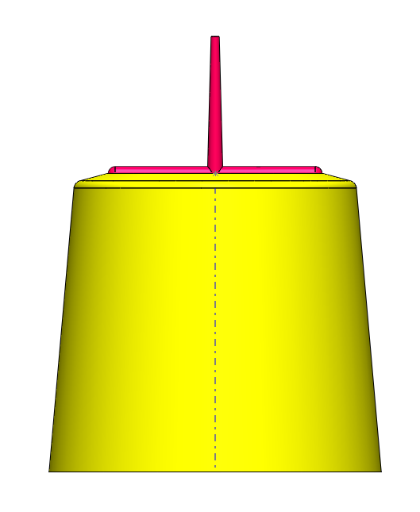  
*Şekil 2: Parçanın 3D gövdesi ile etrafını saran iç-dış helisel conformal soğutma kanalları.*

### 3.2 Geleneksel vs. Conformal Soğutma Kanal Mimarisi
- **Geleneksel Çözüm:** Düz delinmiş hatlar ve iç çekirdeğe yerleştirilen Baffle tipi yönlendirici perdeler.
- **Helisel Conformal Çözüm:** Parçanın silindirik ve konik formuna paralel ilerleyen, cidar mesafesi sabit tutulmuş 10 mm çapında dairesel kesitli çift helis kanallar.

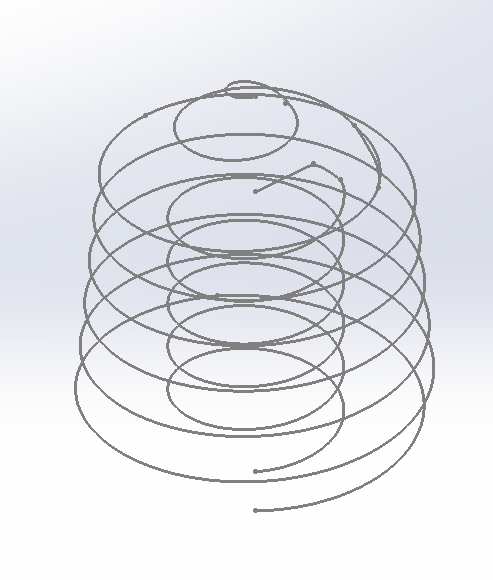  
*Şekil 3: Helis yoğunluğu artırılmış nihai eklemeli imalat kanalı CAD modeli.*

---

## 4. Autodesk Moldflow Analiz Aşamaları

### 4.1 Geometri İçe Aktarma ve Oryantasyon
Parça gövdesi IGES / Parasolid formatında Moldflow ortamına aktarılmıştır. Moldflow'da enjeksiyon akış yönü Z ekseni boyunca tanımlandığından parça X ekseninde 90° döndürülmüş ve çalışma koordinat sistemine oturtulmuştur.

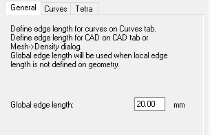  
*Şekil 4: Solid mesh oluşturma parametreleri ve kavisli yüzeyler için kenar yoğunlaştırma ayarları.*

### 4.2 Yolluk Sistemi (Runner & Gates) Tasarımı
Sıcak yolluklar ve besleme kapıları (Side Gates) 5 mm ana yolluk, 3° eğim ve 10 mm dağıtıcı runner boyutlarıyla **Beam elemanlar** kullanılarak tanımlanmıştır. Beam elemanların dairesel kesit hesaplama hassasiyeti, poligon meshleme hatalarını önlemektedir.

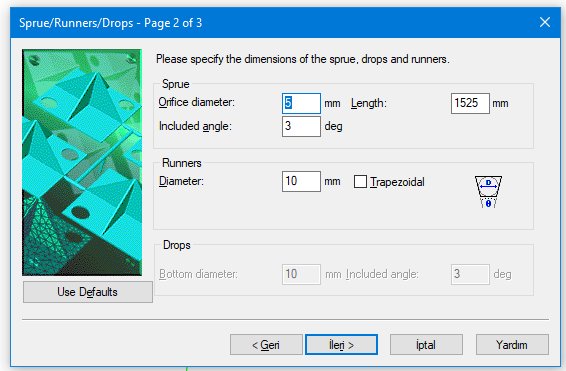  
*Şekil 5: Yolluk ve besleme kapısı bağlantı noktaları.*

### 4.3 Soğutma Kanallarının Eklenmesi ve Reynolds Sayısının Eşitlenmesi
Kanallar IGES formatında `Add` komutu ile modele eklenmiş, `Cooling Channel` olarak tanımlanmıştır. Bilimsel kıyaslamanın doğruluğu için hem geleneksel hem helisel kanallarda **Reynolds sayısı sabitlenerek türbülanslı akış koşulu eşitlenmiştir**.

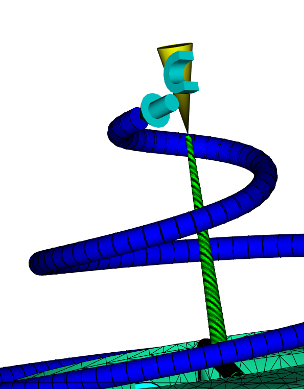  
*Şekil 6: Soğutucu akışkan giriş ve çıkış parametreleri.*

### 4.4 Proses ve Çözücü Parametreleri
- **Eriyik Sıcaklığı:** Standart PEEK proses sıcaklığı
- **Kalıp Açılma Süresi:** 10 saniye
- **Toplam Çevrim Süresi:** 100 saniye (PEEK polimerinin termal kararlılığı için optimize edildi)
- **Warping Çözücü:** *Use mesh aggregation* aktif edilerek diferansiyel soğuma ve çekme etkileri ayrıştırılmıştır.

---

## 5. Simülasyon Sonuçları ve Kıyaslama

### 5.1 Flow (Akış & Dolum) Analizi
Parçanın dolumu **15.9 saniyede** eksiksiz olarak tamamlanmıştır. Çift yönlü besleme nedeniyle akış cephelerinin karşılaştığı noktalarda Weld Lines (kaynak çizgileri) ve iç çentiklerde hava tuzakları (Air Traps) tespit edilmiştir.

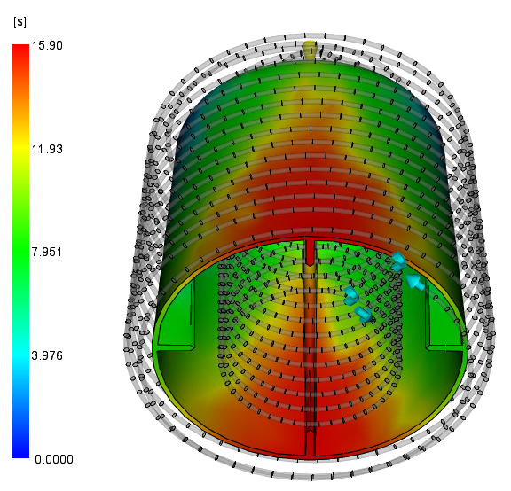  
*Şekil 7: 15.9 saniyelik Flow dolum süresi dağılımı.*

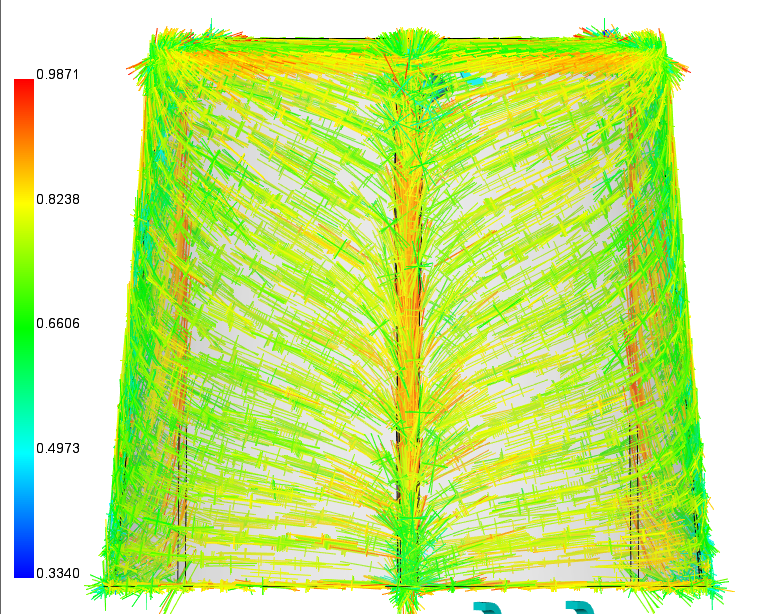  
*Şekil 8: Fiber yönelim sensörü ve kaynak çizgisi lokasyonları.*

### 5.2 Cool (Termal Dağılım) Analizi Karşılaştırması

| Termal Parametre | Geleneksel Soğutma | Helisel Conformal Cooling | Fark / İyileşme |
| :--- | :--- | :--- | :--- |
| **İç Duvar Sıcaklığı** | 199.2°C | **91.65°C** | **-107.55°C Homojenleşme** |
| **Maksimum Kalıp Sıcaklığı** | 269.1°C | **159.6°C** | **-109.50°C Termal Düşüş** |
| **Minimum Parça Sıcaklığı** | 127.4°C | **37.26°C** | **-90.14°C Hızlı Isı Transferi** |

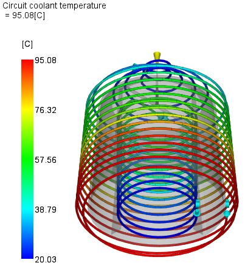  
*Şekil 9: Geleneksel vs. Helisel kalıp içi sıcaklık gradyanı.*

### 5.3 Warp (Çarpılma & Şekil Değiştirme) Analizi Karşılaştırması

| Çarpılma Kriteri | Geleneksel Tasarım | Helisel Conformal Tasarım | İyileşme Oranı (%) |
| :--- | :--- | :--- | :--- |
| **Soğutma Kaynaklı Çarpılma (Differential Cooling)** | 2.246 mm | **1.182 mm** | **%47.4 İyileşme** |
| **Kritik Düğüm 71077 (Taban Çeperi)** | Yüksek Deformasyon | Düşük Deformasyon | **%53.0 İyileşme** |
| **Kritik Düğüm 3072 (Üst Kısım)** | Yüksek Deformasyon | Düşük Deformasyon | **%17.0 İyileşme** |
| **Toplam Çarpılma (Total Deflection)** | 9.912 mm | **8.289 mm** | **%16.4 İyileşme** |

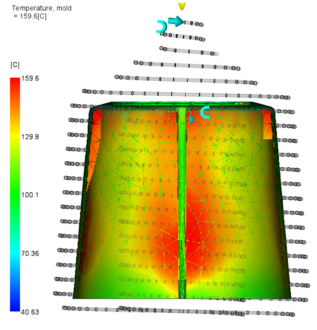  
*Şekil 10: Moldflow Diferansiyel Soğuma kaynaklı net şekil değiştirme (Deflection: Differential Cooling).*

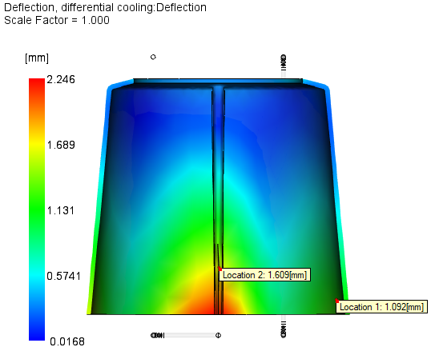  
*Şekil 11: 71077 ve 3072 numaralı kritik mesh düğüm noktalarında deformasyon incelemesi.*

---

## 6. Sonuç ve Mühendislik Değerlendirmesi

1. **Çarpılmanın Minimize Edilmesi:** Eklemeli imalatla üretilen helisel conformal kanallar, soğutmadan kaynaklı boyutsal çarpılmayı **%47.4 oranında azaltmıştır**.
2. **Kritik Bölgelerdeki Başarı:** Taban çeperinde sıcaklığın biriktiği kör noktada (Node 71077) deformasyon **%53.0 düşürülerek** parçanın geometrik toleransları güvenceye alınmıştır.
3. **Moldflow Simülasyonunun Üstünlüğü:** SolidWorks Plastics gibi temel araçların aksine Autodesk Moldflow; et kalınlığı, oryantasyon ve soğuma etkilerini birbirinden yalıtarak conformal cooling'in gerçek termal üstünlüğünü kanıtlamıştır.
4. **Endüstriyel Uygulanabilirlik:** PEEK gibi yüksek maliyetli ve yüksek eriyik sıcaklığına sahip mühendislik plastiklerinde, kalıp içi helisel kanallar parça fire oranlarını düşürmekte ve döngü süresini belirgin şekilde kısaltmaktadır.

---

*Telif Hakkı © 2026 Osman YILDIRIM. Kahramanmaraş Sütçü İmam Üniversitesi Makine Mühendisliği Bölümü.*
